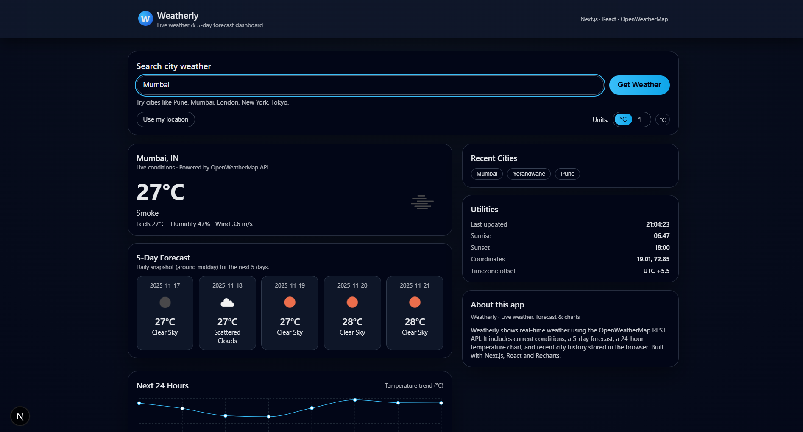
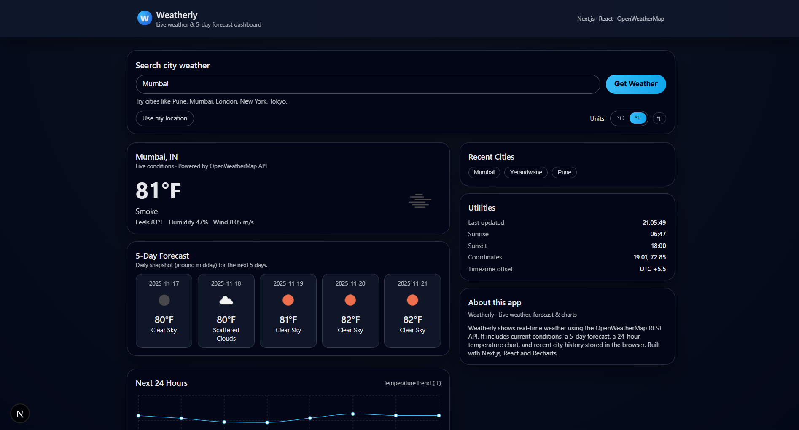

# 🌦️ Weatherly — Real-Time Weather Forecast Dashboard

Weatherly is a fully responsive weather dashboard built using **Next.js (App Router)**, **React**, and the **OpenWeatherMap REST API**.

It provides:

- 🟢 Live current weather conditions
- 📅 5-day forecast
- 🕒 24-hour temperature trend chart
- 📍 GPS-based weather lookup
- 🌡️ °C / °F temperature unit switching
- 🧠 Recent city search history stored locally
- ♿ Accessibility-friendly UI with live announcement regions

This project was developed as part of **Unified Mentor’s Full Stack Web Development Internship (Hard Difficulty Project)**.

---

## 📌 Features

### 🔍 Search
- Search weather for any city worldwide
- Clicking a recent city auto-loads its weather + updates search input

### 🛰️ “Use my location”
- Retrieves weather based on current device coordinates
- Uses browser Geolocation API

### 🌡️ Temperature Units
- Switch between **Celsius (°C)** and **Fahrenheit (°F)**
- Updates all displayed values and charts

### 📊 Charts
- 24-hour temperature curve using **Recharts**
- Displays live temperature trend for the next day

### 🗂️ Local History
- Stores recent searches in `localStorage`
- No backend database required

### 💎 UI / UX
- Clean modern dashboard layout
- Fully responsive across desktop, tablet, and mobile
- Keyboard accessible

---

## 🛠️ Tech Stack

| Layer | Technology |
|-------|------------|
| Framework | Next.js (App Router) |
| UI | React + CSS |
| Charts | Recharts |
| API Provider | OpenWeatherMap REST API |
| Runtime | Node / Vercel Edge |
| State | React Hooks + LocalStorage |

---

## 📂 Project Structure

📦 weatherly
┣ 📁 app
┃ ┣ 📁 api/weather → Unified server route for weather requests
┃ ┣ 📁 components → All UI elements and widget components
┃ ┗ 📜 page.js → Main dashboard page
┣ 📁 public → Icons and static assets
┣ 📜 .env.local → API key (ignored by git)
┣ 📜 package.json
┗ 📜 README.md


---

## 🔑 Environment Variable

Create a `.env.local` file in project root:

OPENWEATHER_API_KEY=your_api_key_here


⚠️ Do **NOT** commit this file.

---

## ▶️ Running the Project

```bash
npm install
npm run dev

Then visit:
http://localhost:3000

✨ Screenshots
Dashboard View	                                                   °F Mode

                                   


👤 Author

Om Patil
Portfolio → https://ompatilportfolio.vercel.app

GitHub → https://github.com/ommpatill

LinkedIn → https://linkedin.com/in/ompatill


📝 License

This project is for education and portfolio use.
You may fork, modify, and improve with attribution.


⭐ Support

If this project helped you, star the repository 🌟